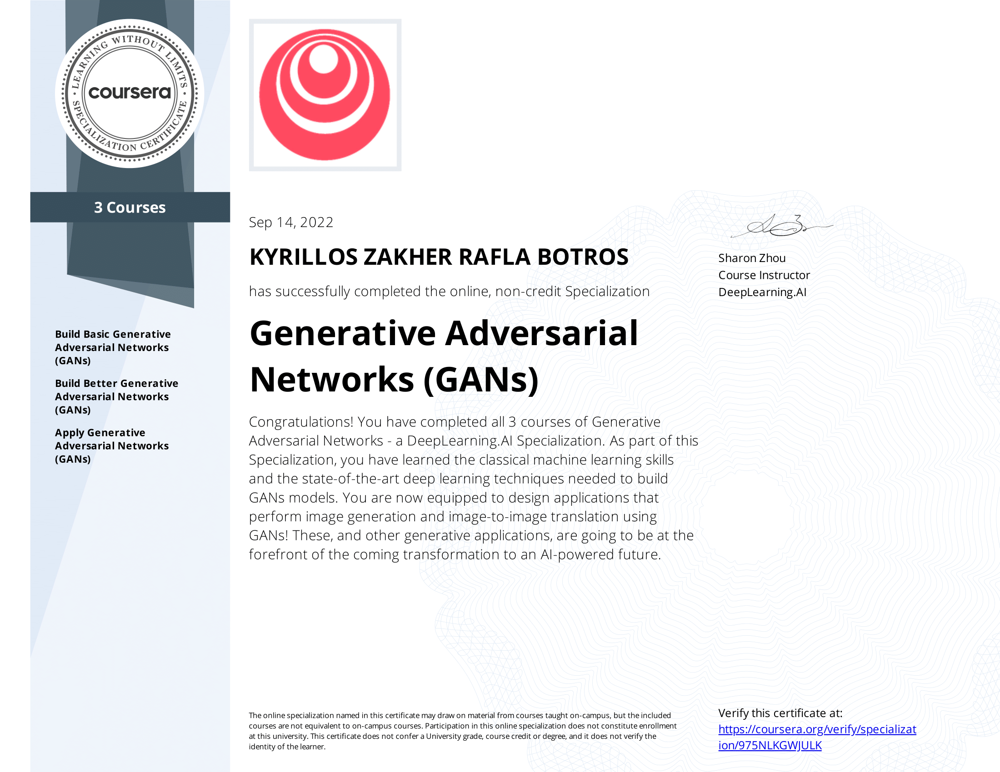
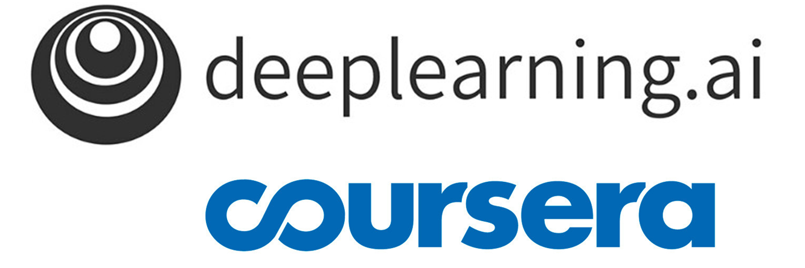

# Generative-Adversarial-Networks-GANs-Specialization-Coursera

## Overview

This specialization consists of three courses as follows:
- **Build Basic Generative Adversarial Networks (GANs)**
  - **Week 1:** Intro to GANs.
  - **Week 2:** Deep Convolutional GANs .
  - **Week 3:** W-GAN with gredient penalty.
  - **Week 4:** Conditional GAN and Controllable Generation. 
  
- **Build Better Generative Adversarial Networks (GANs)**
  - **Week 1:** Evaluation methods of GANs such as FID and IS.
  - **Week 2:** GANs disadvantages and Bias.
  - **Week 3:** StyleGAN architecture.
  
- **Apply Generative Adversarial Networks (GANs)**
  - **Week 1:** GANs Applications such as Augmentation.
  - **Week 2:** Image-to-image translation with Pix2Pix and U-Net architecture.
  - **Week 3:** Unpaired translation with CycleGAN.
  
## Repo Content
- Lecture Notes
- Assignments 
- Extra Labs
- All papers presented in specialization. 
   
   
  ### All Credits goes to [DeepLearning.ai](https://www.deeplearning.ai) and [Coursera](https://www.coursera.org/) for presenting this great knowledge about GANs.
  
  
